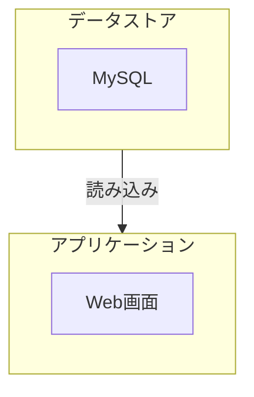

# System Patterns

## Table of Contents
- [System Patterns](#system-patterns)
  - [Table of Contents](#table-of-contents)
  - [システムアーキテクチャ（初期案）](#システムアーキテクチャ初期案)
  - [主要な技術的決定](#主要な技術的決定)
  - [設計パターン](#設計パターン)
  - [コンポーネントの関係](#コンポーネントの関係)

## システムアーキテクチャ（初期案）

- **データストア**
  - MySQL
- **アプリケーション**
  - Web画面

## 主要な技術的決定
変更時にはADRとしてドキュメントに書き残す。

- 言語
  - Rust
- データ永続化
  - 初期はMySQLのDockerコンテナ
- フロントエンド
  - 初期はRust(egui)
- バックエンド
  - 初期はRust

## 設計パターン

- WIP

## コンポーネントの関係

-
